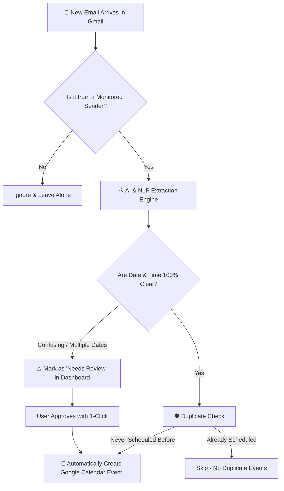

# 📬 MailCal Sync — Smart Gmail to Google Calendar Automation

<p align="center">
  
</p>

<p align="center">
  <strong>Never manually create a calendar event from an email again.</strong><br>
  MailCal Sync automatically monitors your Gmail, reads scheduling emails using AI, and books confirmed events straight into your Google Calendar.
</p>

<p align="center">
  
  
  
  
  
  
</p>

---

## 💡 What is MailCal Sync? (Explained in Plain English)

Have you ever received an email about an **interview**, **exam**, **placement mock test**, or **client meeting**, only to forget to add it to your calendar and scramble at the last minute?

**MailCal Sync solves this completely:**

| 😫 The Old Way | 🚀 With MailCal Sync |
|:---|:---|
| 1. You receive an email with a date & time. | 1. An email arrives in your inbox. |
| 2. You have to read through long paragraphs. | 2. **AI automatically detects:** Title, Date, Time, Duration & Google Meet / Zoom link. |
| 3. You manually open Google Calendar. | 3. **The event is automatically scheduled** into your Google Calendar in the background. |
| 4. You copy-paste the title, time, and link. | 4. You get your standard Google Calendar reminder before the meeting! |
| 5. If you forget... **you miss the meeting!** | 5. **You never miss an important event again.** |

---

## 🔄 How It Works: Step-by-Step



1. **You Pick Who to Watch:** You choose the email addresses to monitor (for example: `updates@topin.tech` or `academy-placements@nxtwave.in` or `hr@company.com`).
2. **Continuous Background Monitoring:** MailCal Sync checks your inbox quietly in the background every 2 minutes.
3. **Smart Extraction:** When a matching email arrives, our AI reads:
   - 📌 **Event Title** (e.g. *Interview Scheduled – Software Engineer*)
   - 🗓️ **Date** (e.g. *September 30, 2026*)
   - ⏰ **Start & End Time** (e.g. *11:00 AM to 11:45 AM IST*)
   - 🔗 **Meeting Link** (Google Meet, Zoom, MS Teams, Webex)
   - 📍 **Location** (*Online* or meeting room)
4. **Instant Calendar Creation:** If the date and time are crystal clear, it creates the Google Calendar event instantly and links the meeting URL.

---

## 🎯 Real-Life Example in Action

### 📧 The Email You Receive:
```text
From: hr@example.com
Subject: Interview Scheduled – Software Engineer

Hi Sriram,
Your interview has been scheduled for September 30, 2026 at 11:00 AM IST.
Duration: 45 minutes
Location: Online
Google Meet: https://meet.google.com/example
Regards,
HR Team
```

### 🤖 What MailCal Sync Automatically Does:

<p align="center">
  
</p>

- **Event Title:** Interview Scheduled – Software Engineer
- **Date:** September 30, 2026
- **Time:** 11:00 AM – 11:45 AM IST
- **Meeting Link:** https://meet.google.com/example
- **Confidence:** **100%** &rarr; Event created immediately in your Google Calendar!

---

## 🛡️ Smart Safeguards (No Spoilers, No Mess, No Duplicates)

### 1. ⚡ Duplicate Protection Guarantee
The same email will **NEVER** create two calendar events. MailCal Sync remembers each email's unique ID. If it has already processed an email, it skips it automatically.

### 2. ⚠️ The "Needs Review" Safety Net
What if an email says: *"We can meet either on Tuesday at 3 PM or Thursday at 5 PM, let me know"*?  
MailCal Sync **will NOT guess** and create the wrong event!  
Instead, it flags the email as **Needs Review** and puts it in your review box:

<p align="center">
  
</p>

You can click **Review & Schedule**, pick the correct slot, and create the event with a single click.

### 3. 🔒 100% Private & Secure
- **No Passwords Stored:** It uses official Google OAuth 2.0. You never type your Google password into this app.
- **Read-Only Gmail Access:** The app can **only read** incoming emails from your chosen senders. It cannot send emails, delete emails, or view your drafts.
- **All Data Stays on Your Machine:** Everything runs locally on your computer with a lightweight SQLite database. No external servers have access to your emails.

---

## 🖥️ Tour of Your Dashboard

Here is a quick visual guide to everything you see on the dashboard:

```text
┌────────────────────────────────────────────────────────────────────────────────────────┐
│  📅 MailCal Sync                                              [Setup Guide] [Connected]│
├────────────────────────────────────────────────────────────────────────────────────────┤
│  ┌──────────────────┐  ┌──────────────────┐  ┌──────────────────┐  ┌────────────────┐  │
│  │  Emails Scanned  │  │  Events Created  │  │   Needs Review   │  │     Errors     │  │
│  │        50        │  │        14        │  │        36        │  │       0        │  │
│  └──────────────────┘  └──────────────────┘  └──────────────────┘  └────────────────┘  │
├───────────────────────────────────────────────────┬────────────────────────────────────┤
│  👤 Google Account & Target Calendar              │  ⚡ Automation Engine              │
│  • User: Sriram Venkat (sriramnbv26@gmail.com)    │  • Background Auto-Sync: [ ON ]    │
│  • Target: Primary Calendar (sriramnbv26@gmail.com│  • [ Check Gmail Now ] (Manual)   │
├───────────────────────────────────────────────────┴────────────────────────────────────┤
│  ⚙️ Sender Monitoring Rules                                      [ + Add Sender Rule ] │
│  • updates@topin.tech            (Duration: 45m | Timezone: IST)               [Active]│
│  • academy-placements@nxtwave.in (Duration: 45m | Timezone: IST)               [Active]│
├────────────────────────────────────────────────────────────────────────────────────────┤
│  📋 Processed Emails History                                                           │
│  • 🚨 NxtMock Today | 11 Sept, 8 PM       [ Event Created ]  [ Open in Google Calendar]│
│  • DSA Assessment Registration Open       [ Event Created ]  [ Open in Google Calendar]│
│  • August Placement Digest                [ Needs Review  ]  [ Review & Schedule ]     │
└────────────────────────────────────────────────────────────────────────────────────────┘
```

| Feature | What It Does |
|---|---|
| **Emails Scanned** | Total number of relevant emails found and processed. |
| **Events Created** | Number of confirmed Google Calendar events successfully created. |
| **Needs Review** | Emails that had ambiguous dates or newsletters without a specific time slot. |
| **Background Auto-Sync** | Flip the switch to **ON** to have MailCal automatically check Gmail every 2 minutes. |
| **"Check Gmail Now"** | Click this button anytime you want an immediate sync without waiting. |
| **+ Add Sender Rule** | Add new email addresses to monitor (e.g. your boss, university, recruiter). |
| **Open in Google Calendar** | Click directly on any created event to open it right inside Google Calendar! |

---

## 🚀 How to Run Locally (3 Simple Steps)

### Step 1: Install Dependencies
Open your terminal in the project directory and run:
```bash
npm install
npm install --prefix server
npm install --prefix client
```

### Step 2: Configure Your `.env`
Copy `.env.example` to `.env`:
```bash
cp .env.example .env
```
Fill in your Google OAuth Client ID and Secret (or follow the in-app Setup Guide):
```env
PORT=5000
CLIENT_URL=http://localhost:5173
GOOGLE_CLIENT_ID=your_id.apps.googleusercontent.com
GOOGLE_CLIENT_SECRET=your_secret
GOOGLE_REDIRECT_URI=http://localhost:5000/api/auth/callback
```

### Step 3: Start the App!
```bash
npm run dev
```
Open **`http://localhost:5173`** in your browser.  
Click **Sign in with Google**, and you're all set! 🎈

---

## ❓ Frequently Asked Questions (FAQ)

<details>
<summary><strong>Will MailCal Sync read all my personal emails?</strong></summary>
<br>
<strong>No!</strong> MailCal Sync only searches for emails matching the exact sender addresses you have configured in your rules (like <code>updates@topin.tech</code>). All other emails in your inbox are completely ignored.
</details>

<details>
<summary><strong>Can I turn it off when I'm on vacation?</strong></summary>
<br>
Yes! Just toggle the <strong>Background Auto-Sync</strong> switch to <strong>OFF</strong> on the dashboard. When you're back, flip it back to <strong>ON</strong>.
</details>

<details>
<summary><strong>What if an email specifies duration instead of an end time?</strong></summary>
<br>
MailCal Sync automatically calculates the end time for you! For example, if an email says <em>"Starts at 3:00 PM, Duration: 45 minutes"</em>, it automatically creates the event from <strong>3:00 PM to 3:45 PM</strong>.
</details>

<details>
<summary><strong>Can I choose which Google Calendar events go into?</strong></summary>
<br>
Yes! If you have multiple calendars (e.g., Work, Personal, College), you can pick which calendar to use right from the dropdown menu on the dashboard.
</details>

---

## 🛠️ Tech Stack (For Developers)

- **Frontend:** React 19, TypeScript, Vite, Vanilla CSS (Glassmorphism design tokens), Lucide Icons
- **Backend:** Node.js, Express, TypeScript, tsx
- **Database:** SQLite with `better-sqlite3` (WAL mode enabled for lightning performance)
- **Google APIs:** Google APIs Client Library (`googleapis`), Gmail API v1, Google Calendar API v3
- **Extraction:** Dual-engine architecture with high-precision Regex NLP parser + optional Google Gemini 1.5/2.0 LLM integration

---

<p align="center">
  Built with ❤️ for hassle-free scheduling. Never miss a meeting again!
</p>
